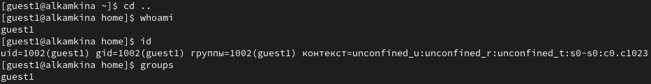
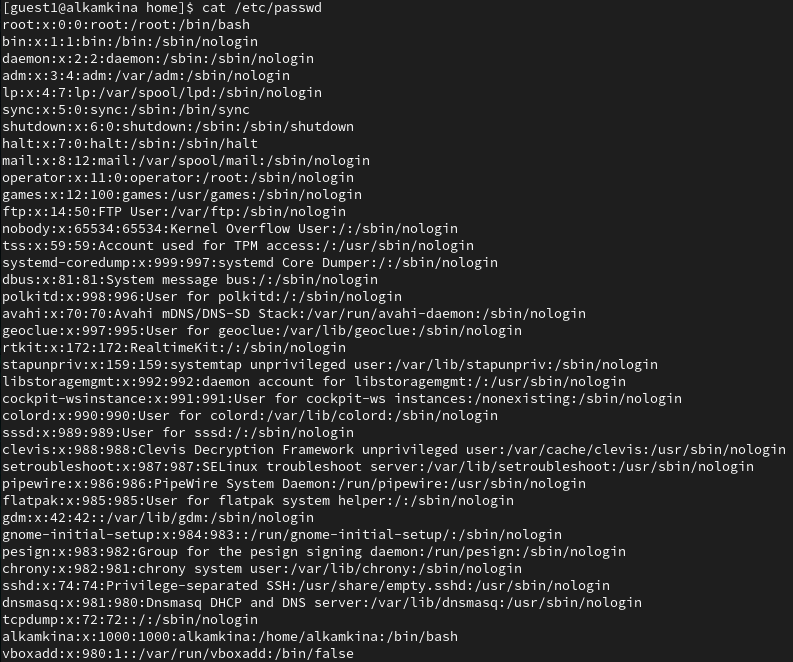
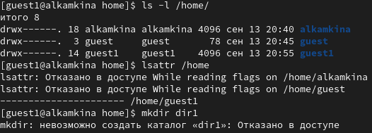
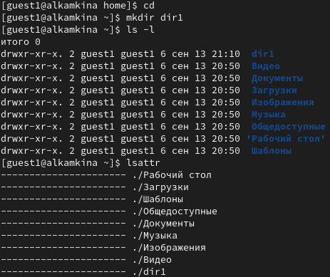
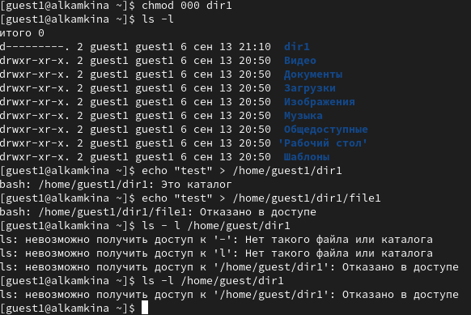

---
## Front matter
lang: ru-RU
title: Лабораторная работа №2
subtitle: Дискреционное разграничение прав в Linux. Основные атрибуты
author:
  - Камкина А. Л.
institute:
  - Российский университет дружбы народов, Москва, Россия

## i18n babel
babel-lang: russian
babel-otherlangs: english

## Formatting pdf
toc: false
toc-title: Содержание
slide_level: 2
aspectratio: 169
section-titles: true
theme: metropolis
header-includes:
 - \metroset{progressbar=frametitle,sectionpage=progressbar,numbering=fraction}
 - '\makeatletter'
 - '\beamer@ignorenonframefalse'
 - '\makeatother'
---

# Информация

## Докладчик

:::::::::::::: {.columns align=center}
::: {.column width="70%"}

  * Камкина Арина Леонидовна
  * студентка группы НКНбд-01-21
  * Российский университет дружбы народов
  * [1032216456@pfur.ru](mailto:1032216456@rudn.ru)
  * <https://alkamkina.github.io/ru/>

:::
::: {.column width="25%"}

:::
::::::::::::::

# Вводная часть

## Цели и задачи

**Цель работы:**

Получение практических навыков работы в консоли с атрибутами файлов, закрепление теоретических основ дискреционного разграничения доступа в современных системах с открытым кодом на базе ОС Linux.

**Задачи:**

- Изучение команд для просмотра и изменения прав доступа
- Составление таблицы с соответствием прав и разрешенных действий

**Инструмент:** VirtualBox - CentOS, cmd

# Выполнение лабораторной работы

## Создала новую учётную запись под именем guest1

{ #fig:001 width=70% }

## Посмотр информации о пользователе

{ #fig:002 width=70% }

## Просмотр файла 

{ #fig:003 width=70% }

## Учётная запись guest1 и группа

{ #fig:004 width=70% }

## Существующие директории, права и расширенные атрибуты

{ #fig:005 width=70% }

## Создание поддиректории

{ #fig:006 width=70% }

## Изменение прав для директории

{ #fig:007 width=70% }

## Минимальные права для совершения действий
| Операция | Минимальные права на директорию | Минимальные права на файл |
|----------|---------------------------------|---------------------------|
|Создание файла|            d(300)               |               (000)            |
|Удаление файла|            d(300)               |               (000)            |
|Чтение файла|            d(100)               |               (400)            |
|Запись в файл|            d(100)               |               (200)            |
|Переименование файла |            d(300)               |               (000)            |
|Создание поддиректории |            d(300)               |               (000)            |
|Удаление поддиректории |            d(300)               |               (000)            |

# Заключение

## Вывод

В процессе выполнения данной лабораторной работы я построила графики, используя Julia и OpenModelica, а также приобрела практические навыки работы с Julia и OpenModelica.
