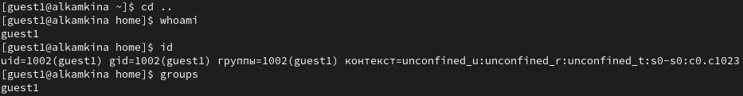
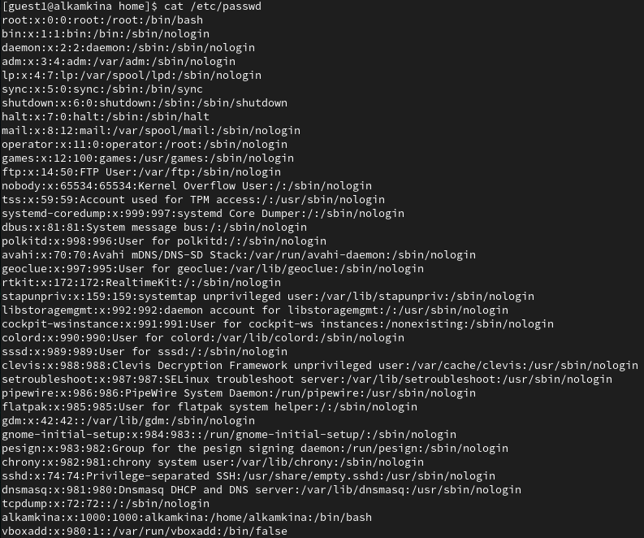
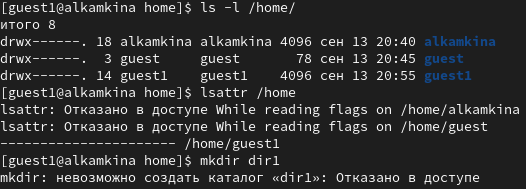
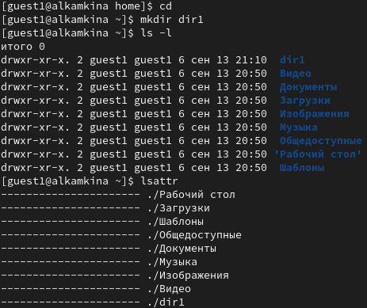
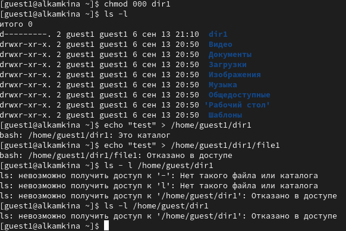
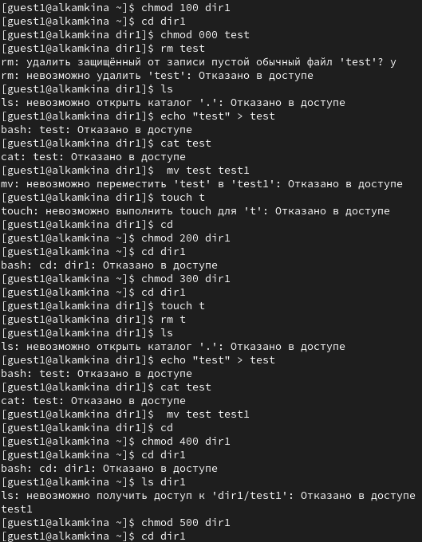

---
## Front matter
title: "Лабораторная работа №2"
subtitle: "Дискреционное разграничение прав в Linux. Основные атрибуты"
author: "Камкина Арина Леонидовна"

## Generic otions
lang: ru-RU
toc-title: "Содержание"

## Bibliography
bibliography: bib/cite.bib
csl: pandoc/csl/gost-r-7-0-5-2008-numeric.csl

## Pdf output format
toc: true # Table of contents
toc-depth: 2
lof: true # List of figures
lot: false # List of tables
fontsize: 12pt
linestretch: 1.5
papersize: a4
documentclass: scrreprt
## I18n polyglossia
polyglossia-lang:
  name: russian
  options:
	- spelling=modern
	- babelshorthands=true
polyglossia-otherlangs:
  name: english
## I18n babel
babel-lang: russian
babel-otherlangs: english
## Fonts
mainfont: PT Serif
romanfont: PT Serif
sansfont: PT Sans
monofont: PT Mono
mainfontoptions: Ligatures=TeX
romanfontoptions: Ligatures=TeX
sansfontoptions: Ligatures=TeX,Scale=MatchLowercase
monofontoptions: Scale=MatchLowercase,Scale=0.9
## Biblatex
biblatex: true
biblio-style: "gost-numeric"
biblatexoptions:
  - parentracker=true
  - backend=biber
  - hyperref=auto
  - language=auto
  - autolang=other*
  - citestyle=gost-numeric
## Pandoc-crossref LaTeX customization
figureTitle: "Рис."
tableTitle: "Таблица"
listingTitle: "Листинг"
lofTitle: "Список иллюстраций"
lotTitle: "Список таблиц"
lolTitle: "Листинги"
## Misc options
indent: true
header-includes:
  - \usepackage{indentfirst}
  - \usepackage{float} # keep figures where there are in the text
  - \floatplacement{figure}{H} # keep figures where there are in the text
---

# Цель работы

Получение практических навыков работы в консоли с атрибутами файлов, закрепление теоретических основ дискреционного разграничения доступа в современных системах с открытым кодом на базе ОС Linux.

# Теоретичсекие сведения

Есть 3 вида разрешений. Соответственно, для каждой категории указывается, какие операции с файлом ей доступны: **чтение (r)**, **запись (w)** или **выполнение (x)** — для исполняемых файлов. Для директорий параметры те же, но обозначают немного другое: **просмотр директории (r)**, **создание папок / файлов (w)** внутри директории, **переход в директорию (x)**.

---

# Выполнение лабораторной работы

1. Создала новую учётную запись под именем guest1 и задала для неё пароль, затем вошла в систему под новым именем(рис. [-@fig:001])

{ #fig:001 width=70% }

2. Командой pwd определила директорию, в которой нахожусь. Сравнив с командной строкой видим, что она совпадает с с именем пользователя, не является домашней директорией.

3. Зашла в домашнюю директоиию, уточнила имя пользователя функцией `whoami` и с помомщью команд `id` и `groups` видим имя пользователя, его id 1002 и группу, в котроую он входит - единственную(рис. [-@fig:002])

{ #fig:002 width=70% }

4. Просмотрела файл командой `cat /etc/passwd`(рис. [-@fig:003])

{ #fig:003 width=70% }

а также нашла в нём свою учетную запись, где увидела группу, которая совпадает с тем, что видела ранее(рис. [-@fig:004])

{ #fig:004 width=70% }

5. Определила существующие в системе директории командой
`ls -l /home/` - это alkamkina, guest1 (и guest с которым не работали), всеми правами влдеет только владелец. Также посмтотрела какие расширенные атрибуты установлены на поддиректориях, находящихся в директории /home, командой:
`lsattr /home` - никакие расширеные атрибуты не установлены для guest1, для других пользователей просмотр невозможен(рис. [-@fig:005])

{ #fig:005 width=70% }

6. Создала в домашней директории поддиректорию dir1 командой
mkdir dir1. Определила командами `ls -l` и `lsattr`, какие права доступа и расширенные атрибуты были выставлены на директорию dir1: для владельца доступны все права, для остальных только чтение и вход, никаких расширенных атрибутов не установлено.(рис. [-@fig:006])

{ #fig:006 width=70% }

7. Сняла с директории dir1 все атрибуты командой
chmod 000 dir1 и проверила с её помощью правильность выполнения команды `ls -l`. Попыталась создать в директории dir1 файл file1 командой `echo "test" > /home/guest/dir1/file1`, но не получилось, так как я забрала все права на эту дирректорию - получили отказ в создании.`ls -l /home/guest/dir1` - просмотр директории также невозможен(рис. [-@fig:007])

{ #fig:007 width=70% }

8. Опытным путём заполила таблицу, меняя права директории и файла(рис. [-@fig:008])

{ #fig:008 width=70% }

В таблице [-@tbl:tbl1] приведены данные по разрешенным и запрещенным действиям при различных правах: {#tbl:tbl1}

| Права директории | Права файла | Создание файла | Удаление файла | Запись в файл | Чтение файла | Смена директории | Просмотр файлов в директории | Переименование файла | Смена атрибутов файла |
|------------|-----------|--------|--------|--------|--------|--------|--------|--------|--------|
|   d(000)   |   (000)   |    -    | -       | -       |   -     |  -      |  -      |  -      | -       |
|   d(100)   |   (000)   |    -    |     -   |   -     |     -   |    +    |   -     |   -     |    +    |
|   d(200)   |   (000)   |    -    | -       | -       |   -     |  -      |  -      |  -      | -       |
|   d(300)   |   (000)   |    +    |     +   |      -  |   -     |     +   |     -   |    +    |   +     |
|   d(400)   |   (000)   |    -    | -       | -       |   -     |  -      |  +      |  -      | -       |
|   d(500)   |   (000)   |   -     |  -      |    -    |   -     |    +    |    +    | -       |   +     |
|   d(600)   |   (000)   |    -    | -       | -       |   -     |  -      |  +      |  -      | -       |
|   d(700)   |   (000)   |     +   | +       |     -   |     -   |   +     |   +     |     +   |    +    |
|   d(000)   |   (100)   |    -    |     -   |     -   |  -      |     -   |  -      | -       | -       |
|   d(100)   |   (100)   |    -    |-        |    -    |     -   |    +    |  -      | -       |    +    |
|   d(200)   |   (100)   |     -   | -       |   -     |   -    |     -   |   -     |   -     |  -      |
|   d(300)   |   (100)   |      +  |  +      |    -    |  -      |      +  |    -    |     +   |    +    |
|   d(400)   |   (100)   |       - |   -     |   -     |     -   |       - |     +   |      -  |  -      |
|   d(500)   |   (100)   |       - |    -    |    -    |-        |        +|      +  | -       |+        |
|   d(600)   |   (100)   |    -    | -       | -       |   -     |  -      |  +      |  -      | -       |
|   d(700)   |   (100)   |+        |      +  |       - |  -      | +       |        +|   +     |  +      |
|   d(000)   |   (200)   |    -    |     -   |     -   |  -      |     -   |  -      | -       | -       |
|   d(100)   |   (200)   | -       |       - |     +   |   -     |  +      |-        |    -    |   +     |
|   d(200)   |   (200)   |    -    |     -   |     -   |  -      |     -   |  -      | -       | -       |
|   d(300)   |   (200)   |   +     |+        |  +      |   -     |    +    |  -      |     +   |    +    |
|   d(400)   |   (200)   |       - |   -     |   -     |     -   |       - |     +   |      -  |  -      |
|   d(500)   |   (200)   |     -   |  -      |   +     |    -    |      +  |    +    |      -  |     +   |
|   d(600)   |   (200)   |    -    | -       | -       |   -     |  -      |  +      |  -      | -       |
|   d(700)   |   (200)   |   +     |    +    |    +    |     -   |        +|      +  |        +|       + |
|   d(000)   |   (300)   |    -    |     -   |     -   |  -      |     -   |  -      | -       | -       |
|   d(100)   |   (300)   |    -    |     -   |     +   |      -  |+        |-        |       - |        +|
|   d(200)   |   (300)   |    -    |     -   |     -   |  -      |     -   |  -      | -       | -       |
|   d(300)   |   (300)   |      +  |       + |      +  |       - |  +      |  -      |   +     |   +     |
|   d(400)   |   (300)   |       - |   -     |   -     |     -   |       - |     +   |      -  |  -      |
|   d(500)   |   (300)   |        -| -       |       + |        -|    +    |    +    |    -    |    +    |
|   d(600)   |   (300)   |    -    | -       | -       |   -     |  -      |  +      |  -      | -       |
|   d(700)   |   (300)   | +       |   +     |        +| -       |      +  |      +  |      +  |      +  |
|   d(000)   |   (400)   |    -    |     -   |     -   |  -      |     -   |  -      | -       | -       |
|   d(100)   |   (400)   |  -      |    -    |  -      |  +      |       + | -       |       - |       + |
|   d(200)   |   (400)   |    -    |     -   |     -   |  -      |     -   |  -      | -       | -       |
|   d(300)   |   (400)   |    +    |      +  |    -    |   +     |+        |   -     |        +|        +|
|   d(400)   |   (400)   |       - |   -     |   -     |     -   |       - |     +   |      -  |  -      |
|   d(500)   |   (400)   |      -  |        -|     -   |    +    |  +      |     +   |  -      |+        |
|   d(600)   |   (400)   |    -    | -       | -       |   -     |  -      |  +      |  -      | -       |
|   d(700)   |   (400)   |        +| +       |      -  |     +   |    +    |       + |    +    |  +      |
|   d(000)   |   (500)   |    -    |     -   |     -   |  -      |     -   |  -      | -       | -       |
|   d(100)   |   (500)   |-        |  -      |  -      |   +     |     +   |  -      |     -   |   +     |
|   d(200)   |   (500)   |    -    |     -   |     -   |  -      |     -   |  -      | -       | -       |
|   d(300)   |   (500)   |  +      |     +   |   -     |  +      |       + |  -      |      +  |    +    |
|   d(400)   |   (500)   |       - |   -     |   -     |     -   |       - |     +   |      -  |  -      |
|   d(500)   |   (500)   |    -    |       - |    -    | +       |+        |   +     |       - |     +   |
|   d(600)   |   (500)   |    -    | -       | -       |   -     |  -      |  +      |  -      | -       |
|   d(700)   |   (500)   |      +  |+        |     -   |+        |  +      |     +   |     +   |       + |
|   d(000)   |   (600)   |    -    |     -   |     -   |  -      |     -   |  -      | -       | -       |
|   d(100)   |   (600)   |       - | -       |        +|     +   |   +     | -       |      -  |        +|
|   d(200)   |   (600)   |    -    |     -   |     -   |  -      |     -   |  -      | -       | -       |
|   d(300)   |   (600)   |+        |   +     |       + |      +  |     +   |   -     |       + |    +    |
|   d(400)   |   (600)   |       - |   -     |   -     |     -   |       - |     +   |      -  |  -      |
|   d(500)   |   (600)   |  -      |     -   |      +  |       + |       + |     +   |        -|     +   |
|   d(600)   |   (600)   |    -    | -       | -       |   -     |  -      |  +      |  -      | -       |
|   d(700)   |   (600)   |    +    |       + |     +   |        +|+        |       + |     +   |       + |
|   d(000)   |   (700)   |    -    |     -   |     -   |  -      |     -   |  -      | -       | -       |
|   d(100)   |   (700)   |     -   |-        |       + |    +    | +       |-        |      -  |        +|
|   d(200)   |   (700)   |    -    |     -   |     -   |  -      |     -   |  -      | -       | -       |
|   d(300)   |   (700)   |       + |  +      |        +|   +     |   +     |  -      |       + |   +     |
|   d(400)   |   (700)   |       - |   -     |   -     |     -   |       - |     +   |      -  |  -      |
|   d(500)   |   (700)   |  -      |    -    |   +     | +       |     +   |    +    |       - |    +    |
|   d(600)   |   (700)   |    -    | -       | -       |   -     |  -      |  +      |  -      | -       |
|   d(700)   |   (700)   |   +     | +       |  +      |   +     |  +      |   +     |   +     |  +      |

В таблице [-@tbl:tbl2]приведены минимальные права для совершения действий: {#tbl:tbl2}

| Операция | Минимальные права на директорию | Минимальные права на файл |
|----------|---------------------------------|---------------------------|
|Создание файла|            d(300)               |               (000)            |
|Удаление файла|            d(300)               |               (000)            |
|Чтение файла|            d(100)               |               (400)            |
|Запись в файл|            d(100)               |               (200)            |
|Переименование файла |            d(300)               |               (000)            |
|Создание поддиректории |            d(300)               |               (000)            |
|Удаление поддиректории |            d(300)               |               (000)            |

---

# Вывод

В ходе выполнекния работы приобрела практические навыки работы в консоли с атрибутами файлов, закрепила теоретические основы дискреционного разграничения доступа в современных системах с открытым кодом на базе ОС Linux.

---

