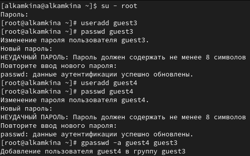
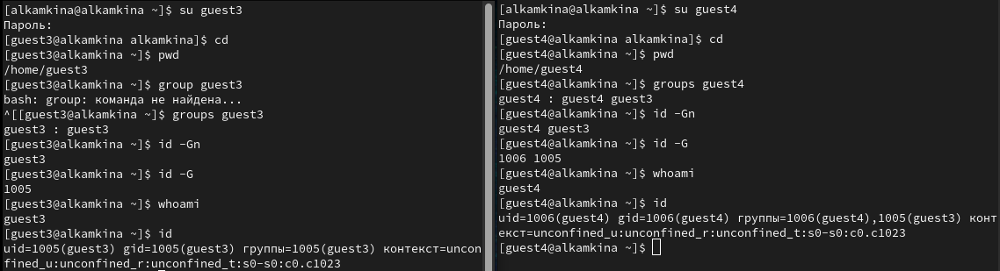
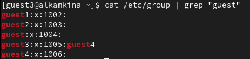
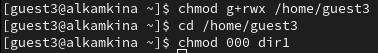
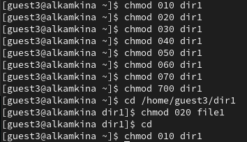

---
## Front matter
title: "Лабораторная работа №3"
subtitle: "Дискреционное разграничение прав в Linux. Два пользователя"
author: "Камкина Арина Леонидовна"

## Generic otions
lang: ru-RU
toc-title: "Содержание"

## Bibliography
bibliography: bib/cite.bib
csl: pandoc/csl/gost-r-7-0-5-2008-numeric.csl

## Pdf output format
toc: true # Table of contents
toc-depth: 2
lof: true # List of figures
lot: false # List of tables
fontsize: 12pt
linestretch: 1.5
papersize: a4
documentclass: scrreprt
## I18n polyglossia
polyglossia-lang:
  name: russian
  options:
	- spelling=modern
	- babelshorthands=true
polyglossia-otherlangs:
  name: english
## I18n babel
babel-lang: russian
babel-otherlangs: english
## Fonts
mainfont: PT Serif
romanfont: PT Serif
sansfont: PT Sans
monofont: PT Mono
mainfontoptions: Ligatures=TeX
romanfontoptions: Ligatures=TeX
sansfontoptions: Ligatures=TeX,Scale=MatchLowercase
monofontoptions: Scale=MatchLowercase,Scale=0.9
## Biblatex
biblatex: true
biblio-style: "gost-numeric"
biblatexoptions:
  - parentracker=true
  - backend=biber
  - hyperref=auto
  - language=auto
  - autolang=other*
  - citestyle=gost-numeric
## Pandoc-crossref LaTeX customization
figureTitle: "Рис."
tableTitle: "Таблица"
listingTitle: "Листинг"
lofTitle: "Список иллюстраций"
lotTitle: "Список таблиц"
lolTitle: "Листинги"
## Misc options
indent: true
header-includes:
  - \usepackage{indentfirst}
  - \usepackage{float} # keep figures where there are in the text
  - \floatplacement{figure}{H} # keep figures where there are in the text
---

# Цель работы

Получение практических навыков работы в консоли с атрибутами файлов для групп пользователей.

# Теоретичсекие сведения

Есть 3 вида разрешений. Соответственно, для каждой категории указывается, какие операции с файлом ей доступны: **чтение (r)**, **запись (w)** или **выполнение (x)** — для исполняемых файлов. Для директорий параметры те же, но обозначают немного другое: **просмотр директории (r)**, **создание папок / файлов (w)** внутри директории, **переход в директорию (x)**.

---

# Выполнение лабораторной работы

1. Создала новые учётные записи под именем guest3 и guest4 и задала для них пароли. Затем добавила пользователя guest4 в группу guest3(рис. [-@fig:001])

{ #fig:001 width=70% }

2. Осуществила вход в систему от двух пользователей на двух разных консолях: guest3 на первой консоли и guest4 на второй консоли. Для обоих пользователей командой pwd определила директорию, в которой нахожусь - она совпадает с приглашение командной строки. Уточнила имя пользователей, группу, кто входит в неё и к каким группам принадлежит он сам - guest3 принадлежит группе guest3, а guest4 принадлежит группам guest3 и guest4(рис. [-@fig:002])

{ #fig:002 width=70% }

4. Просмотрела файл командой `cat /etc/passwd` - информация сопадает(рис. [-@fig:003])

{ #fig:003 width=70% }

5. От имени пользователя guest4 выполнила регистрацию пользователя guest4 в группе guest3(рис. [-@fig:004])

{ #fig:004 width=70% }

5. От имени пользователя guest3 изменила права директории /home/guest3, разрешив все действия для пользователей группы, а также сняла с директории /home/guest/dir1 все атрибуты 
(рис. [-@fig:005])

{ #fig:005 width=70% }

6. Далее начала заполнение таблицы - меняла права директории и файлов в консоли guest3 и проверяла в консоли guest4(рис. [-@fig:006])(рис. [-@fig:007])

{ #fig:006 width=70% }

{ #fig:007 width=70% }

В таблице [-@tbl:tbl1] приведены данные по разрешенным и запрещенным действиям при различных правах: {#tbl:tbl1}

| Права директории | Права файла | Создание файла | Удаление файла | Запись в файл | Чтение файла | Смена директории | Просмотр файлов в директории | Переименование файла | Смена атрибутов файла |
|------------|-----------|---------|---------|---------|---------|---------|---------|---------|---------|
|   d(000)   |   (000)   |    -    |    -    |    -    |    -    |    -    |    -    |    -    |    -    |
|   d(010)   |   (000)   |    -    |    -    |    -    |    -    |    +    |    -    |    -    |    -    |
|   d(020)   |   (000)   |    -    |    -    |    -    |    -    |    -    |    -    |    -    |    -    |
|   d(030)   |   (000)   |    +    |    +    |    -    |    -    |    +    |    -    |    +    |    -    |
|   d(040)   |   (000)   |    -    |    -    |    -    |    -    |    -    |    +    |    -    |    -    |
|   d(050)   |   (000)   |    -    |    -    |    -    |    -    |    +    |    +    |    -    |    -    |
|   d(060)   |   (000)   |    -    |    -    |    -    |    -    |    -    |    +    |    -    |    -    |
|   d(070)   |   (000)   |    +    |    +    |    -    |    -    |    +    |    +    |    +    |    -    |
|   d(000)   |   (010)   |    -    |    -    |    -    |    -    |    -    |    -    |    -    |    -    |
|   d(010)   |   (010)   |    -    |    -    |    -    |    -    |    +    |    -    |    -    |    -    |
|   d(020)   |   (010)   |    -    |    -    |    -    |    -    |    -    |    -    |    -    |    -    |
|   d(030)   |   (010)   |    +    |    +    |    -    |    -    |    +    |    -    |    +    |    -    |
|   d(040)   |   (010)   |    -    |    -    |    -    |    -    |    -    |    +    |    -    |    -    |
|   d(050)   |   (010)   |    -    |    -    |    -    |    -    |    +    |    +    |    -    |    -    |
|   d(060)   |   (010)   |    -    |    -    |    -    |    -    |    -    |    +    |    -    |    -    |
|   d(070)   |   (010)   |    +    |    +    |    -    |    -    |    +    |    +    |    +    |    -    |
|   d(000)   |   (020)   |    -    |    -    |    -    |    -    |    -    |    -    |    -    |    -    |
|   d(010)   |   (020)   |    -    |    -    |    +    |    -    |    +    |    -    |    -    |    -    |
|   d(020)   |   (020)   |    -    |    -    |    -    |    -    |    -    |    -    |    -    |    -    |
|   d(030)   |   (020)   |    +    |    +    |    +    |    -    |    +    |    -    |    +    |    -    |
|   d(040)   |   (020)   |    -    |    -    |    -    |    -    |    -    |    +    |    -    |    -    |
|   d(050)   |   (020)   |    -    |    -    |    +    |    -    |    +    |    +    |    -    |    -    |
|   d(060)   |   (020)   |    -    |    -    |    -    |    -    |    -    |    +    |    -    |    -    |
|   d(070)   |   (020)   |    +    |    +    |    +    |    -    |    +    |    +    |    +    |    -    |
|   d(000)   |   (030)   |    -    |    -    |    -    |    -    |    -    |    -    |    -    |    -    |
|   d(010)   |   (030)   |    -    |    -    |    +    |    -    |    +    |    -    |    -    |    -    |
|   d(020)   |   (030)   |    -    |    -    |    -    |    -    |    -    |    -    |    -    |    -    |
|   d(030)   |   (030)   |    +    |    +    |    +    |    -    |    +    |    -    |    +    |    -    |
|   d(040)   |   (030)   |    -    |    -    |    -    |    -    |    -    |    +    |    -    |    -    |
|   d(050)   |   (030)   |    -    |    -    |    +    |    -    |    +    |    +    |    -    |    -    |
|   d(060)   |   (030)   |    -    |    -    |    -    |    -    |    -    |    +    |    -    |    -    |
|   d(070)   |   (030)   |    +    |    +    |    +    |    -    |    +    |    +    |    +    |    -    |
|   d(000)   |   (040)   |    -    |    -    |    -    |    -    |    -    |    -    |    -    |    -    |
|   d(010)   |   (040)   |    -    |    -    |    -    |    +    |    +    |    -    |    -    |    -    |
|   d(020)   |   (040)   |    -    |    -    |    -    |    -    |    -    |    -    |    -    |    -    |
|   d(030)   |   (040)   |    +    |    +    |    -    |    +    |    +    |    -    |    +    |    -    |
|   d(040)   |   (040)   |    -    |    -    |    -    |    -    |    -    |    +    |    -    |    -    |
|   d(050)   |   (040)   |    -    |    -    |    -    |    +    |    +    |    +    |    -    |    -    |
|   d(060)   |   (040)   |    -    |    -    |    -    |    -    |    -    |    +    |    -    |    -    |
|   d(070)   |   (040)   |    +    |    +    |    -    |    +    |    +    |    +    |    +    |    -    |
|   d(000)   |   (050)   |    -    |    -    |    -    |    -    |    -    |    -    |    -    |    -    |
|   d(010)   |   (050)   |    -    |    -    |    -    |    +    |    +    |    -    |    -    |    -    |
|   d(020)   |   (050)   |    -    |    -    |    -    |    -    |    -    |    -    |    -    |    -    |
|   d(030)   |   (050)   |    +    |    +    |    -    |    +    |    +    |    -    |    +    |    -    |
|   d(040)   |   (050)   |    -    |    -    |    -    |    -    |    -    |    +    |    -    |    -    |
|   d(050)   |   (050)   |    -    |    -    |    -    |    +    |    +    |    +    |    -    |    -    |
|   d(060)   |   (050)   |    -    |    -    |    -    |    -    |    -    |    +    |    -    |    -    |
|   d(070)   |   (050)   |    +    |    +    |    -    |    +    |    +    |    +    |    +    |    -    |
|   d(000)   |   (060)   |    -    |    -    |    -    |    -    |    -    |    -    |    -    |    -    |
|   d(010)   |   (060)   |    -    |    -    |    +    |    +    |    +    |    -    |    -    |    -    |
|   d(020)   |   (060)   |    -    |    -    |    -    |    -    |    -    |    -    |    -    |    -    |
|   d(030)   |   (060)   |    +    |    +    |    +    |    +    |    +    |    -    |    +    |    -    |
|   d(040)   |   (060)   |    -    |    -    |    -    |    -    |    -    |    +    |    -    |    -    |
|   d(050)   |   (060)   |    -    |    -    |    +    |    +    |    +    |    +    |    -    |    -    |
|   d(060)   |   (060)   |    -    |    -    |    -    |    -    |    -    |    +    |    -    |    -    |
|   d(070)   |   (060)   |    +    |    +    |    +    |    +    |    +    |    +    |    +    |    -    |
|   d(000)   |   (070)   |    -    |    -    |    -    |    -    |    -    |    -    |    -    |    -    |
|   d(010)   |   (070)   |    -    |    -    |    +    |    +    |    +    |    -    |    -    |    -    |
|   d(020)   |   (070)   |    -    |    -    |    -    |    -    |    -    |    -    |    -    |    -    |
|   d(030)   |   (070)   |    +    |    +    |    +    |    +    |    +    |    -    |    +    |    -    |
|   d(040)   |   (070)   |    -    |    -    |    -    |    -    |    -    |    +    |    -    |    -    |
|   d(050)   |   (070)   |    -    |    -    |    +    |    +    |    +    |    +    |    -    |    -    |
|   d(060)   |   (070)   |    -    |    -    |    -    |    -    |    -    |    +    |    -    |    -    |
|   d(070)   |   (070)   |    +    |    +    |    +    |    +    |    +    |    +    |    +    |    -    |

В таблице [-@tbl:tbl2]приведены минимальные права для совершения действий: {#tbl:tbl2}

| Операция | Минимальные права на директорию | Минимальные права на файл |
|-----------------------|------------|-----------|
|Создание файла|            d(030)               |               (000)            |
|Удаление файла|            d(030)               |               (000)            |
|Чтение файла|            d(010)               |               (040)            |
|Запись в файл|            d(010)               |               (020)            |
|Переименование файла |            d(030)               |               (000)            |
|Создание поддиректории |            d(030)               |               (000)            |
|Удаление поддиректории |            d(030)               |               (000)            |

---

# Вывод

В ходе выполнения работы приобрела практические навыки работы в консоли с атрибутами файлов для групп пользователей.

---

