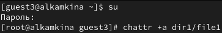
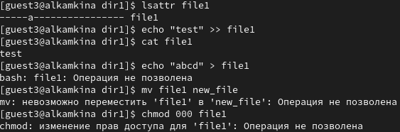
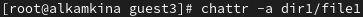

---
## Front matter
lang: ru-RU
title: Лабораторная работа №4
subtitle: Дискреционное разграничение прав в Linux. Расширенные атрибуты
author:
  - Камкина А. Л.
institute:
  - Российский университет дружбы народов, Москва, Россия

## i18n babel
babel-lang: russian
babel-otherlangs: english

## Formatting pdf
toc: false
toc-title: Содержание
slide_level: 2
aspectratio: 169
section-titles: true
theme: metropolis
header-includes:
 - \metroset{progressbar=frametitle,sectionpage=progressbar,numbering=fraction}
 - '\makeatletter'
 - '\beamer@ignorenonframefalse'
 - '\makeatother'
---

# Информация

## Докладчик

:::::::::::::: {.columns align=center}
::: {.column width="70%"}

  * Камкина Арина Леонидовна
  * студентка группы НКНбд-01-21
  * Российский университет дружбы народов
  * [1032216456@pfur.ru](mailto:1032216456@rudn.ru)
  * <https://alkamkina.github.io/ru/>

:::
::: {.column width="25%"}

:::
::::::::::::::

# Вводная часть

## Цели и задачи

**Цель работы:**

Получение практических навыков работы в консоли с расширенными атрибутами файлов.

**Задачи:**

- Изучение команд для просмотра и изменения прав доступа
- Просмотр возможных действий с различными расширенными атрибутами

**Инструмент:** VirtualBox - CentOS, cmd

# Выполнение лабораторной работы

## От имени пользователя guest3 определила расширенные атрибуты файла

{ #fig:001 width=70% }

## Установила расширенный атрибут a на file1

{ #fig:002 width=70% }

## Выполнила несколько действий с раширенным атрибутом a

{ #fig:003 width=70% }

## Сняла раширенный атрибут a

{ #fig:004 width=70% }

## Повтор действий без атрибута

{ #fig:005 width=70% }

## Установила расширенный атрибут i  на file1

{ #fig:006 width=70% }

## Повтор действий с расширенным атрибутом i

{ #fig:007 width=70% }

# Заключение

## Вывод

В результате выполнения работы вы повысили свои навыки использования интерфейса командой строки, познакомились на примерах с тем, как используются основные и расширенные атрибуты при разграничении доступа. 