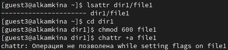
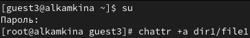
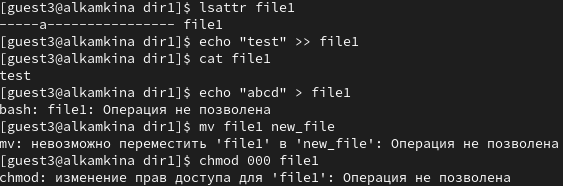
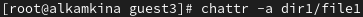
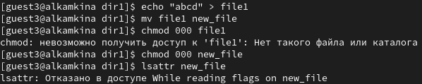
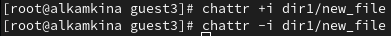
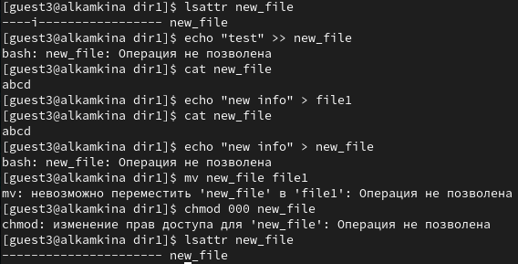

---
## Front matter
title: "Лабораторная работа №4"
subtitle: "Дискреционное разграничение прав в Linux. Расширенные атрибуты"
author: "Камкина Арина Леонидовна"

## Generic otions
lang: ru-RU
toc-title: "Содержание"

## Bibliography
bibliography: bib/cite.bib
csl: pandoc/csl/gost-r-7-0-5-2008-numeric.csl

## Pdf output format
toc: true # Table of contents
toc-depth: 2
lof: true # List of figures
lot: false # List of tables
fontsize: 12pt
linestretch: 1.5
papersize: a4
documentclass: scrreprt
## I18n polyglossia
polyglossia-lang:
  name: russian
  options:
	- spelling=modern
	- babelshorthands=true
polyglossia-otherlangs:
  name: english
## I18n babel
babel-lang: russian
babel-otherlangs: english
## Fonts
mainfont: PT Serif
romanfont: PT Serif
sansfont: PT Sans
monofont: PT Mono
mainfontoptions: Ligatures=TeX
romanfontoptions: Ligatures=TeX
sansfontoptions: Ligatures=TeX,Scale=MatchLowercase
monofontoptions: Scale=MatchLowercase,Scale=0.9
## Biblatex
biblatex: true
biblio-style: "gost-numeric"
biblatexoptions:
  - parentracker=true
  - backend=biber
  - hyperref=auto
  - language=auto
  - autolang=other*
  - citestyle=gost-numeric
## Pandoc-crossref LaTeX customization
figureTitle: "Рис."
tableTitle: "Таблица"
listingTitle: "Листинг"
lofTitle: "Список иллюстраций"
lotTitle: "Список таблиц"
lolTitle: "Листинги"
## Misc options
indent: true
header-includes:
  - \usepackage{indentfirst}
  - \usepackage{float} # keep figures where there are in the text
  - \floatplacement{figure}{H} # keep figures where there are in the text
---

# Цель работы

Получение практических навыков работы в консоли с расширенными атрибутами файлов.

# Теоретичсекие сведения

Есть 3 вида разрешений. Соответственно, для каждой категории указывается, какие операции с файлом ей доступны: **чтение (r)**, **запись (w)** или **выполнение (x)** — для исполняемых файлов. Для директорий параметры те же, но обозначают немного другое: **просмотр директории (r)**, **создание папок / файлов (w)** внутри директории, **переход в директорию (x)**.

---

# Выполнение лабораторной работы

1. От имени пользователя guest3 определила расширенные атрибуты файла и установила на файл file1 права, разрешающие чтение и запись для владельца файла. Попробовала установить расширенный атрибут a - получила отказ(рис. [-@fig:001])

{ #fig:001 width=70% }

2. Зашла на вторую консоль под суперпользователем и установила расширенный атрибут a на file1(рис. [-@fig:002])

{ #fig:002 width=70% }

3. Проверила правильность установления атрибута, записала текст в файл и просмотрела его, попрбовала изменить содержимое и переименовать файл, поменять права - Операци не позволены(рис. [-@fig:003])

{ #fig:003 width=70% }

4. От имени суперпользователя сняла расширеный атрибут a(рис. [-@fig:004])

{ #fig:004 width=70% }

5. Повторила все операции, всё, что было не позволено сделать - теперь можно
(рис. [-@fig:005])

{ #fig:005 width=70% }

6. Установила расширенный атрибут i (затем сняла его) (рис. [-@fig:006])

{ #fig:006 width=70% }

7. Повторили все действия, что и с расширенным атрибутом a - внести (поменять) информацию в файле, просмотреть егои поменять права доступа невозможно(рис. [-@fig:006])

{ #fig:007 width=70% }

---

# Вывод

В результате выполнения работы вы повысили свои навыки использования интерфейса командой строки, познакомились на примерах с тем, как используются основные и расширенные атрибуты при разграничении доступа. 

---

