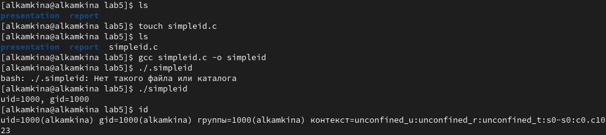
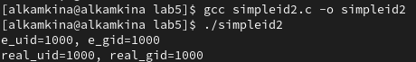
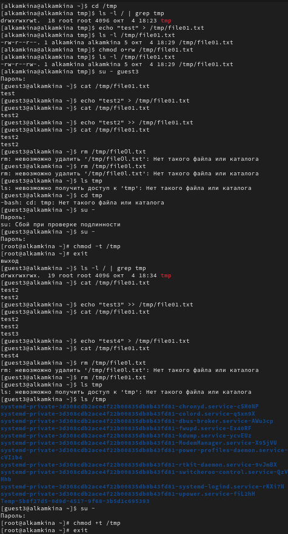

---
## Front matter
lang: ru-RU
title: Лабораторная работа №5
subtitle: Дискреционное
разграничение прав в Linux. Исследование
влияния дополнительных атрибутов

author:
  - Камкина А. Л.
institute:
  - Российский университет дружбы народов, Москва, Россия

## i18n babel
babel-lang: russian
babel-otherlangs: english

## Formatting pdf
toc: false
toc-title: Содержание
slide_level: 2
aspectratio: 169
section-titles: true
theme: metropolis
header-includes:
 - \metroset{progressbar=frametitle,sectionpage=progressbar,numbering=fraction}
 - '\makeatletter'
 - '\beamer@ignorenonframefalse'
 - '\makeatother'
---

# Информация

## Докладчик

:::::::::::::: {.columns align=center}
::: {.column width="70%"}

  * Камкина Арина Леонидовна
  * студентка группы НКНбд-01-21
  * Российский университет дружбы народов
  * [1032216456@pfur.ru](mailto:1032216456@rudn.ru)
  * <https://alkamkina.github.io/ru/>

:::
::: {.column width="25%"}

:::
::::::::::::::

# Вводная часть

## Цели и задачи

**Цель работы:**

Изучение механизмов изменения идентификаторов, применения
SetUID- и Sticky-битов. Получение практических навыков работы в консоли с дополнительными атрибутами. Рассмотрение работы механизма смены идентификатора процессов пользователей, а также влияние бита Sticky на запись и удаление файлов.

**Задачи:**

- Изучение механизмов изменения идентификаторов, применения
SetUID- и Sticky-битов
- Просмотр влияние бита Sticky на запись и удаление файлов

**Инструмент:** VirtualBox - CentOS, cmd

# Выполнение лабораторной работы

## Прверили установлен ли компилятор gcc - установлен

{ #fig:001 width=70% }

## Работа с simpleid.c

{ #fig:002 width=70% }

## Текст программы simpleid.c

{ #fig:003 width=70% }

## Работа с simpleid2.c

{ #fig:003 width=70% }

## Компиляция и запуск simpleid2.c

{ #fig:005 width=70% }

## Работа с арибутами

{ #fig:006 width=70% }

## Создание readfile.c

{ #fig:007 width=70% }

## 8. Текст программы readfile.c

{ #fig:008 width=70% }

## Просмотр файла readfile.c

{ #fig:009 width=70% }

## Исследование Sticky-бита

{ #fig:010 width=70% }

# Заключение

## Вывод

В результате выполнения работы я изучила механизмы изменения идентификаторов и применения SetUID- и Sticky-битов