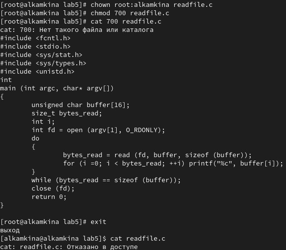

---
## Front matter
title: "Лабораторная работа №5"
subtitle: "Дискреционное
разграничение прав в Linux. Исследование
влияния дополнительных атрибутов
"
author: "Камкина Арина Леонидовна"

## Generic otions
lang: ru-RU
toc-title: "Содержание"

## Bibliography
bibliography: bib/cite.bib
csl: pandoc/csl/gost-r-7-0-5-2008-numeric.csl

## Pdf output format
toc: true # Table of contents
toc-depth: 2
lof: true # List of figures
lot: false # List of tables
fontsize: 12pt
linestretch: 1.5
papersize: a4
documentclass: scrreprt
## I18n polyglossia
polyglossia-lang:
  name: russian
  options:
	- spelling=modern
	- babelshorthands=true
polyglossia-otherlangs:
  name: english
## I18n babel
babel-lang: russian
babel-otherlangs: english
## Fonts
mainfont: PT Serif
romanfont: PT Serif
sansfont: PT Sans
monofont: PT Mono
mainfontoptions: Ligatures=TeX
romanfontoptions: Ligatures=TeX
sansfontoptions: Ligatures=TeX,Scale=MatchLowercase
monofontoptions: Scale=MatchLowercase,Scale=0.9
## Biblatex
biblatex: true
biblio-style: "gost-numeric"
biblatexoptions:
  - parentracker=true
  - backend=biber
  - hyperref=auto
  - language=auto
  - autolang=other*
  - citestyle=gost-numeric
## Pandoc-crossref LaTeX customization
figureTitle: "Рис."
tableTitle: "Таблица"
listingTitle: "Листинг"
lofTitle: "Список иллюстраций"
lotTitle: "Список таблиц"
lolTitle: "Листинги"
## Misc options
indent: true
header-includes:
  - \usepackage{indentfirst}
  - \usepackage{float} # keep figures where there are in the text
  - \floatplacement{figure}{H} # keep figures where there are in the text
---

# Цель работы

Изучение механизмов изменения идентификаторов, применения
SetUID- и Sticky-битов. Получение практических навыков работы в консоли с дополнительными атрибутами. Рассмотрение работы механизма смены идентификатора процессов пользователей, а также влияние бита Sticky на запись и удаление файлов.

# Теоретичсекие сведения

Есть 3 вида разрешений. Соответственно, для каждой категории указывается, какие операции с файлом ей доступны: **чтение (r)**, **запись (w)** или **выполнение (x)** — для исполняемых файлов. Для директорий параметры те же, но обозначают немного другое: **просмотр директории (r)**, **создание папок / файлов (w)** внутри директории, **переход в директорию (x)**.

---

# Выполнение лабораторной работы

1. Прверили установлен ли компилятор gcc - установлен.(рис. [-@fig:001])

{ #fig:001 width=70% }

2. Перешла в каталог, где лежат все файлы дабораторной работы №5: lab5, создала файл simpleid.c, затем скомпилировала и запустила полученный файл(рис. [-@fig:002])

{ #fig:002 width=70% }

Данные, которые выводит программа и данные с функции id идентичны.

3. Текст программы simpleid.c(рис. [-@fig:003])

{ #fig:003 width=70% }

4. Затем таким же способом создала программу simpleid2.c(рис. [-@fig:004])

{ #fig:004 width=70% }

5. Скомпилировала simpleid2.с и запустила
(рис. [-@fig:005])

{ #fig:005 width=70% }

6. От имени суперпользователя выполнила следующие команды и проверила правильность установки новых атрибутов и снова запустили файл simpleid2(рис. [-@fig:006])

{ #fig:006 width=70% }

7. Таким же способом создала программу readfile.c, дала все права, тк без них редактирование было невозможно, скомпилировала файл(рис. [-@fig:006])

{ #fig:007 width=70% }

8. Текст программы readfile.c(рис. [-@fig:008])

{ #fig:008 width=70% }

9. Меняю права доступа и пытаюсь просмотерть файл серез суперпользователя (возможно) и обычного пользователя (невозможно)(рис. [-@fig:009])

{ #fig:009 width=70% }

10. Исследовали Sticky-бит меняя пользователя и добавляя (убирая) права(рис. [-@fig:010])

{ #fig:010 width=70% }

---

# Вывод

В результате выполнения работы я изучила механизмы изменения идентификаторов и применения SetUID- и Sticky-битов

---

