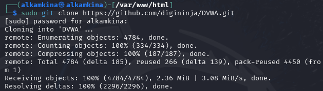
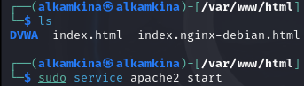
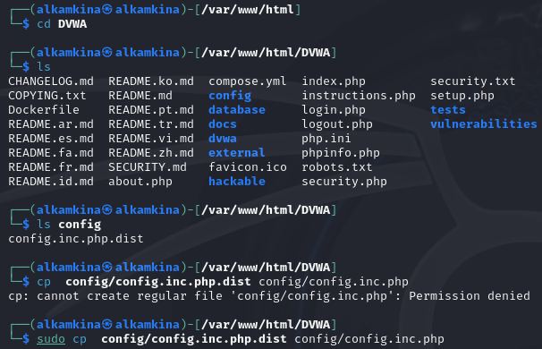
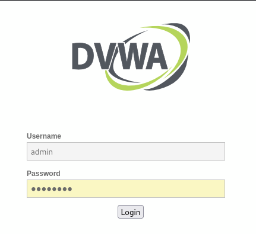

---
## Front matter
lang: ru-RU
title: Индивидуальный проект. Этап №2
subtitle: Установка DVWA
author:
  - Камкина А. Л.
institute:
  - Российский университет дружбы народов, Москва, Россия

## i18n babel
babel-lang: russian
babel-otherlangs: english

## Formatting pdf
toc: false
toc-title: Содержание
slide_level: 2
aspectratio: 169
section-titles: true
theme: metropolis
header-includes:
 - \metroset{progressbar=frametitle,sectionpage=progressbar,numbering=fraction}
 - '\makeatletter'
 - '\beamer@ignorenonframefalse'
 - '\makeatother'
---

# Информация

## Докладчик

:::::::::::::: {.columns align=center}
::: {.column width="70%"}

  * Камкина Арина Леонидовна
  * студентка группы НКНбд-01-21
  * Российский университет дружбы народов
  * [1032216456@pfur.ru](mailto:1032216456@rudn.ru)
  * <https://alkamkina.github.io/ru/>

:::
::: {.column width="25%"}

:::
::::::::::::::

# Вводная часть

## Цели и задачи

**Цель работы:**

Установить DVWA в гостевую систему к Kali Linux.

**Задачи:**

- Установить DVWA на Kali Linux
- Настроить DVWA

**Инструмент:** VirtualBox

# Выполнение лабораторной работы

## Переход в каталог

{ #fig:001 width=70% }

## Клонирование репозитория

{ #fig:002 width=70% }

## Запуск веб сервера

{ #fig:003 width=70% }

## Веб сервер apache2

{ #fig:004 width=70% }

## Копирование фала

{ #fig:005 width=70% }

## Просмотр файла

{ #fig:006 width=70% }

## Стартовое окно DVWA

{ #fig:007 width=70% }

## Создание пользователя

{ #fig:008 width=70% }

## Создание пользователя

{ #fig:009 width=70% }

## Вход

{ #fig:010 width=70% }

## Стартовая страница DVWA

{ #fig:011 width=70% }

# Заключение

## Вывод

В ходе выполнения работы был установлен DVWA на Kali Linux.
