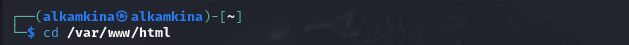
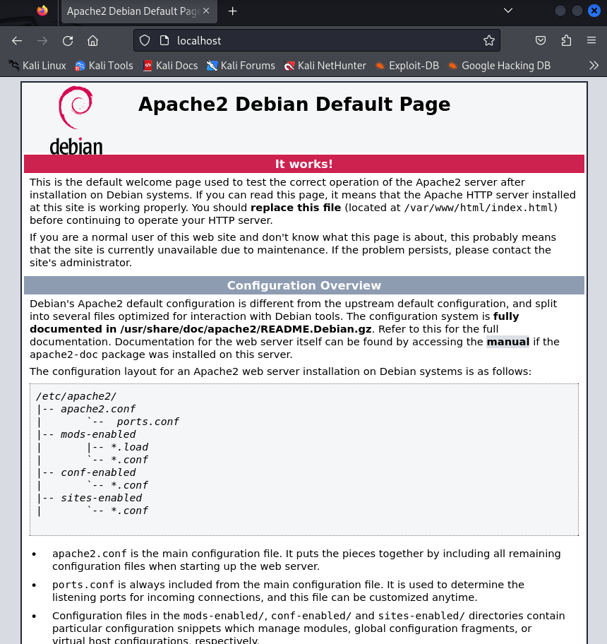
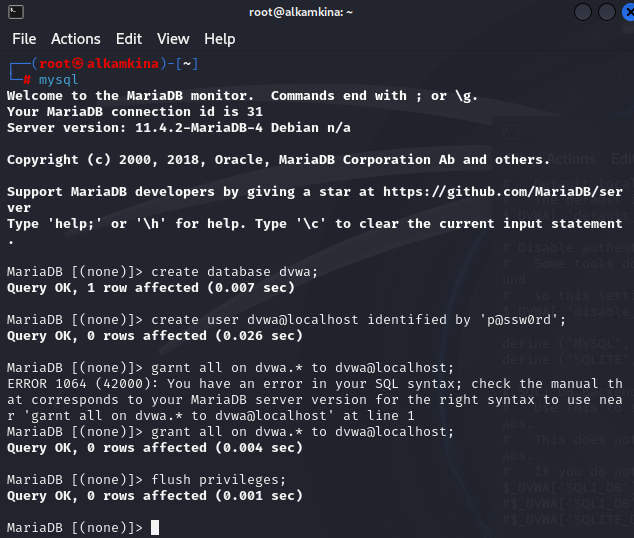
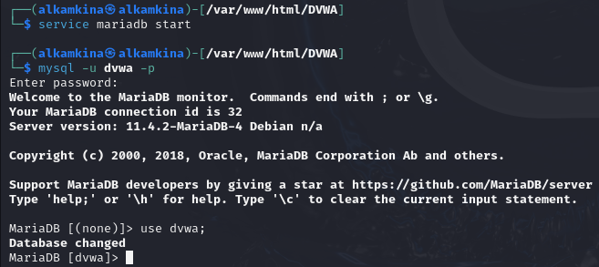

---
## Front matter
title: "Индивидуальный проект. Этап №2"
subtitle: "Установка DVWA"
author: "Камкина Арина Леонидовна"

## Generic otions
lang: ru-RU
toc-title: "Содержание"

## Bibliography
bibliography: bib/cite.bib
csl: pandoc/csl/gost-r-7-0-5-2008-numeric.csl

## Pdf output format
toc: true # Table of contents
toc-depth: 2
lof: true # List of figures
lot: false # List of tables
fontsize: 12pt
linestretch: 1.5
papersize: a4
documentclass: scrreprt
## I18n polyglossia
polyglossia-lang:
  name: russian
  options:
	- spelling=modern
	- babelshorthands=true
polyglossia-otherlangs:
  name: english
## I18n babel
babel-lang: russian
babel-otherlangs: english
## Fonts
mainfont: PT Serif
romanfont: PT Serif
sansfont: PT Sans
monofont: PT Mono
mainfontoptions: Ligatures=TeX
romanfontoptions: Ligatures=TeX
sansfontoptions: Ligatures=TeX,Scale=MatchLowercase
monofontoptions: Scale=MatchLowercase,Scale=0.9
## Biblatex
biblatex: true
biblio-style: "gost-numeric"
biblatexoptions:
  - parentracker=true
  - backend=biber
  - hyperref=auto
  - language=auto
  - autolang=other*
  - citestyle=gost-numeric
## Pandoc-crossref LaTeX customization
figureTitle: "Рис."
tableTitle: "Таблица"
listingTitle: "Листинг"
lofTitle: "Список иллюстраций"
lotTitle: "Список таблиц"
lolTitle: "Листинги"
## Misc options
indent: true
header-includes:
  - \usepackage{indentfirst}
  - \usepackage{float} # keep figures where there are in the text
  - \floatplacement{figure}{H} # keep figures where there are in the text
---

# Цель работы

Установить DVWA в гостевую систему к Kali Linux.

---

# Теоретические сведения

**Damn Vulnerable Web Application (DVWA)** — это PHP/MySQL веб-приложение, которое чертовски уязвимо. Его главная цель — помочь специалистам по безопасности проверить свои навыки и инструменты в правовой среде, помочь веб-разработчикам лучше понять процессы защиты веб-приложений и помочь как студентам, так и преподавателям узнать о безопасности веб-приложений в контролируемой среде класса.

**Цель** DVWA — **отработать некоторые из наиболее распространенных веб-уязвимостей** , с различными уровнями сложности , с простым понятным интерфейсом. Обратите внимание, что в этом программном обеспечении есть как документированные, так и недокументированные уязвимости . Это сделано намеренно. Вам предлагается попытаться обнаружить как можно больше проблем.

---

# Выполнение лабораторной работы

Перейдём в нужный каталог и скопировали в него файлы(рис. [-@fig:001])(рис. [-@fig:002])

{ #fig:001 width=70% }
{ #fig:002 width=70% }

Запустим веб сервера(рис. [-@fig:003])

{ #fig:003 width=70% }

Веб сервер(рис. [-@fig:004])

{ #fig:004 width=70% }

Копируем файл конфигураций DVWA для безопасного изменения(рис. [-@fig:005])

{ #fig:005 width=70% }

Просмотрим файл конфигураций(рис. [-@fig:006])

{ #fig:006 width=70% }

Стартовое окно(рис. [-@fig:007])

{ #fig:007 width=70% }

Запускаем сервер mariadb. Открываем терминал от имени администратора и создаём базу данных и пользователя(рис. [-@fig:008])(рис. [-@fig:009])

{ #fig:008 width=70% }

{ #fig:009 width=70% }

Взодим в учетную запись(рис. [-@fig:010])

{ #fig:010 width=70% }

Стартовая тсраница(рис. [-@fig:011])

{ #fig:011 width=70% }

---

# Вывод

В ходе выполнения работы был установлен DVWA на Kali Linux.

---

