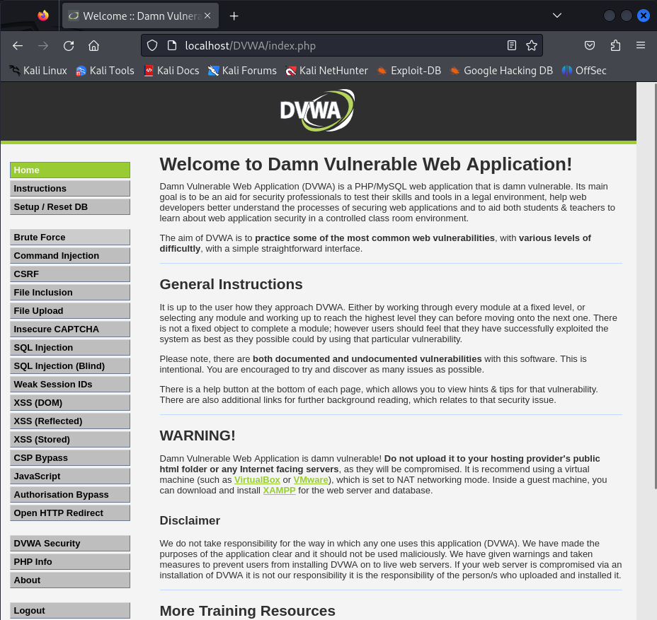
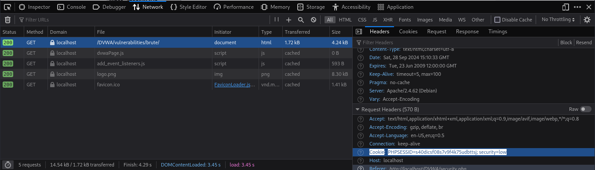

---
## Front matter
lang: ru-RU
title: Индивидуальный проект. Этап №3
subtitle: Использование Hydra
author:
  - Камкина А. Л.
institute:
  - Российский университет дружбы народов, Москва, Россия

## i18n babel
babel-lang: russian
babel-otherlangs: english

## Formatting pdf
toc: false
toc-title: Содержание
slide_level: 2
aspectratio: 169
section-titles: true
theme: metropolis
header-includes:
 - \metroset{progressbar=frametitle,sectionpage=progressbar,numbering=fraction}
 - '\makeatletter'
 - '\beamer@ignorenonframefalse'
 - '\makeatother'
---

# Информация

## Докладчик

:::::::::::::: {.columns align=center}
::: {.column width="70%"}

  * Камкина Арина Леонидовна
  * студентка группы НКНбд-01-21
  * Российский университет дружбы народов
  * [1032216456@pfur.ru](mailto:1032216456@rudn.ru)
  * <https://alkamkina.github.io/ru/>

:::
::: {.column width="25%"}

:::
::::::::::::::

# Вводная часть

## Цели и задачи

**Цель работы:**

Подобрать пароль для пользователя, используя Hydra.

**Задачи:**

- Провести brute force атаку
- Подобрать необходимый для логина пароль

**Инструмент:** VirtualBox

# Выполнение лабораторной работы

## Переход на веб сервер DVWA

{ #fig:001 width=70% }

## Установка самомого низкого уровня защиты

{ #fig:002 width=70% }

## Страница для brute force атаки

{ #fig:003 width=70% }

## Окно Network

{ #fig:004 width=70% }

## Распаковка файла с популярными паролями

{ #fig:005 width=70% }

## Запрос к Hydra - пароли

{ #fig:006 width=70% }

## Верный логин и пароль

{ #fig:007 width=70% }

# Заключение

## Вывод

В ходе выполнения работы была проведена brute force атака c помощью Hydra.
